<h1 align="center">득템시루</h1>

  <b>오늘 팔리지 않으면 버려지는 상품을 가까운 소비자에게 빠르게 연결합니다</b> 
  시흥시 지역화폐 시루 기반 마감 할인 픽업 커머스 프로젝트

  
  
  
  

  <a href="https://github.com/deuktemsiru/frontend-buyer">Buyer App</a> /
  <a href="https://github.com/deuktemsiru/frontend-seller">Seller App</a> /
  <a href="https://github.com/deuktemsiru/backend">Backend</a>

---

## 프로젝트 소개 · 핵심 기능

  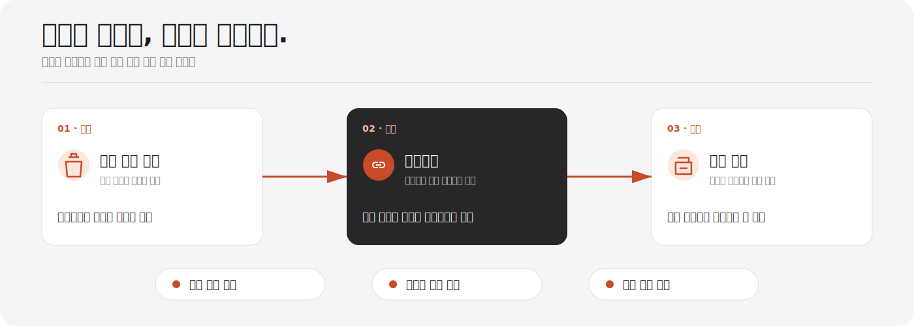

  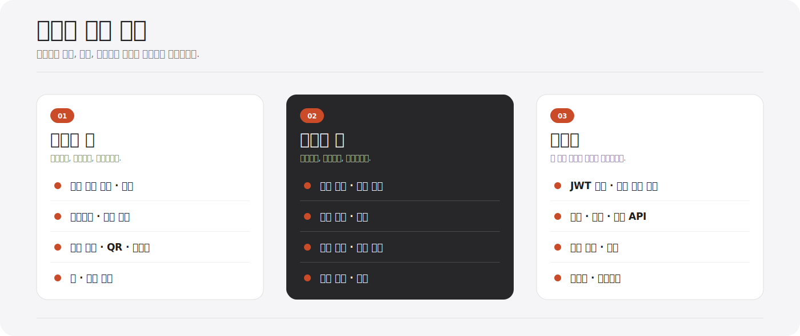

## 시스템 아키텍처

  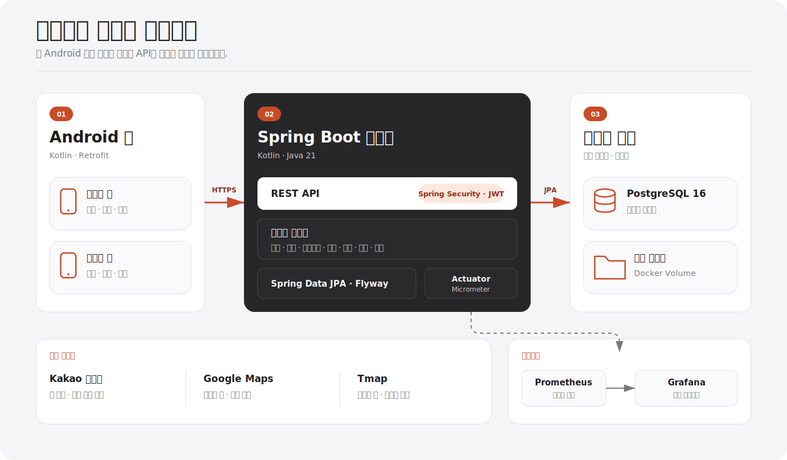

두 앱의 공통 비즈니스 로직을 한 곳에서 일관되게 관리하고, PostgreSQL 트랜잭션으로 주문·정산 데이터의 정합성을 보장하기 위해 이 구조를 선택했습니다.

또한 모니터링을 분리해 작은 팀에서도 운영 상태를 빠르게 파악할 수 있도록 했습니다.

## 앱 화면

### 구매자 앱

<table>
  <tr>
    <th>홈</th>
    <th>찜</th>
    <th>주문 내역</th>
    <th>마이페이지</th>
  </tr>
  <tr>
    <td>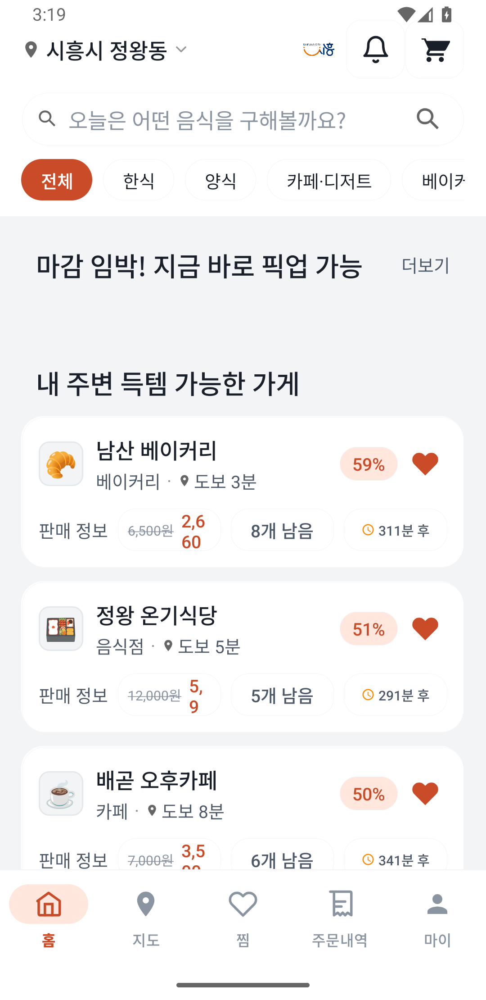</td>
    <td>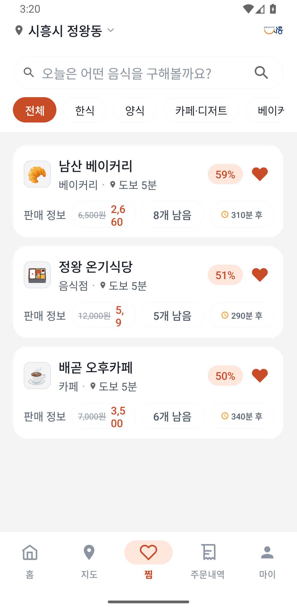</td>
    <td>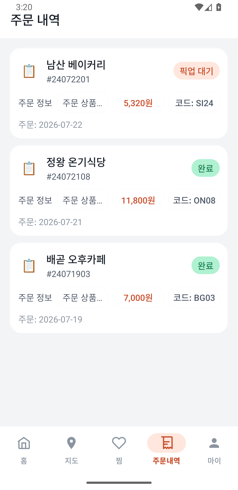</td>
    <td>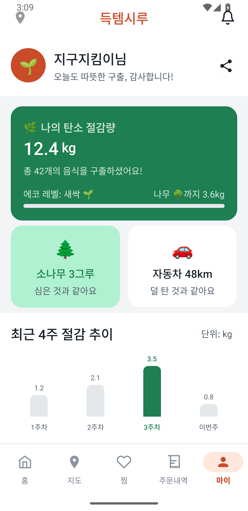</td>
  </tr>
</table>

### 판매자 앱

<table>
  <tr>
    <th>홈</th>
    <th>주문 관리</th>
    <th>매출 분석</th>
    <th>상품 관리</th>
  </tr>
  <tr>
    <td>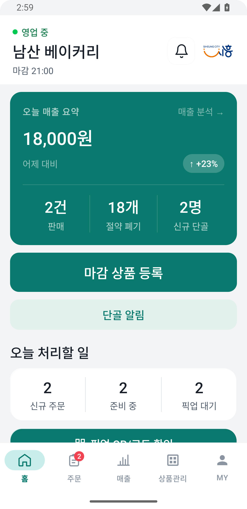</td>
    <td>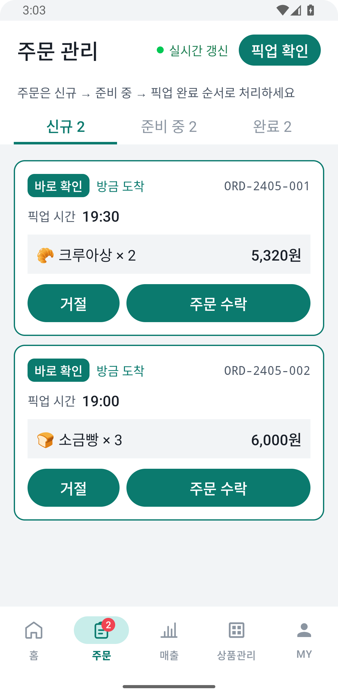</td>
    <td>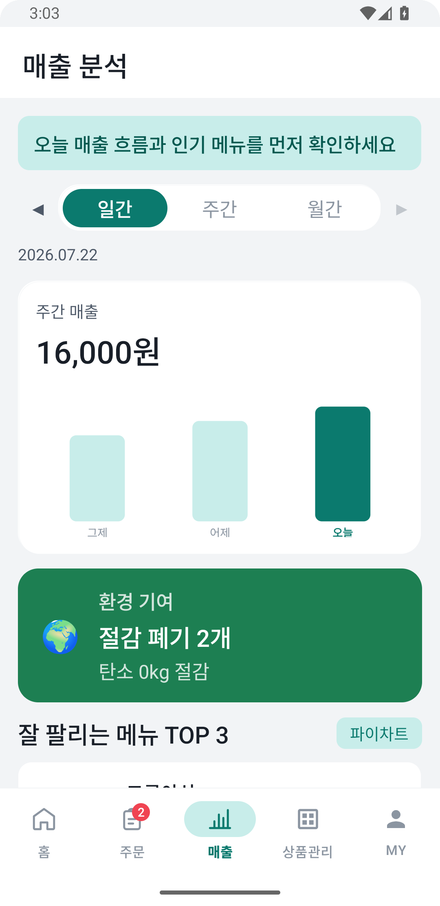</td>
    <td>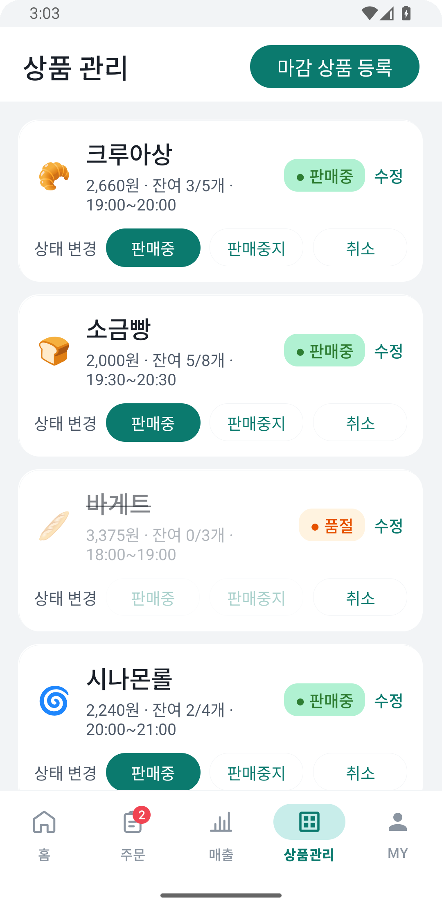</td>
  </tr>
</table>

## 포스터

  

  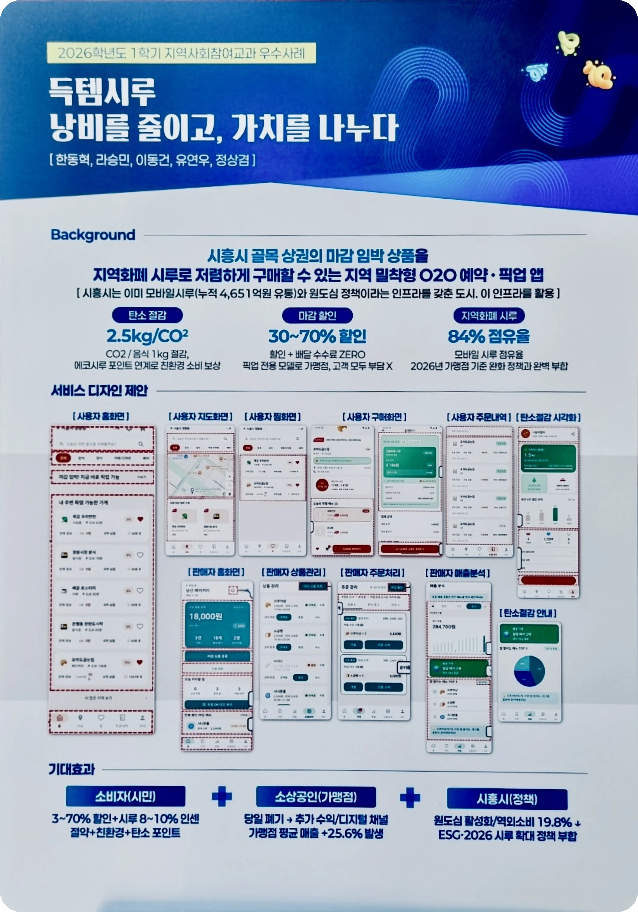

## 팀 구성

<table>
  <tr><td align="center"></td><td><b>한동혁</b> 팀장 · 프론트엔드</td><td>구매자 앱 (지도 SDK, 장바구니·찜, 경로 안내)</td></tr>
  <tr><td align="center"></td><td><b>정상겸</b> 기획 · 풀스택</td><td>구매자·판매자 앱 및 백엔드 연동, 테스트·모니터링, 문서 작성</td></tr>
  <tr><td align="center"></td><td><b>이동건</b> 풀스택 · 인프라</td><td>백엔드 ERD·API 설계, Kakao 로그인, AWS 배포</td></tr>
  <tr><td align="center"></td><td><b>유연우</b> 프론트엔드 · PPT</td><td>판매자 앱 (픽업 코드, 상품관리·고객 알림), 발표 자료</td></tr>
  <tr><td align="center"></td><td><b>라승민</b> 프론트엔드</td><td>구매자 앱 (UI)</td></tr>
</table>
