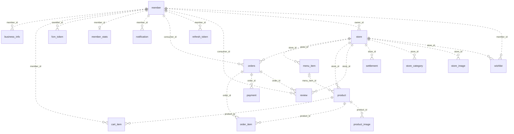

# 득템시루 데이터 모델

[요구사항](../spec.md) · [구현 계획](../plan.md) · [API 계약](contracts.md)

## 기준과 범위

이 문서는 데이터 관계, 저장하는 값의 의미, 무결성 규칙을 설명한다. 컬럼 타입·nullable·열거형 전체 목록은 다음 원본을 확인한다.

- [JPA 엔티티](https://github.com/DeuktemSiru/Backend/tree/main/src/main/kotlin/com/deuktemsiru/entity): 전체 모델과 매핑. 엔티티 생성자 초기값은 DB `DEFAULT`와 구분한다.
- [Flyway SQL](https://github.com/DeuktemSiru/Backend/tree/main/src/main/resources/db/migration): 기존 스키마에 적용하는 변경과 제약.
- [운영 설정](https://github.com/DeuktemSiru/Backend/blob/main/src/main/resources/application-prod.properties): 기본 `ddl-auto=validate`, Flyway 활성. 개발 기본값은 `create-drop`, Flyway 비활성이다.

현재 V1~V5는 기존 DB 변경분이며 초기 스키마 생성 SQL이 없다. Flyway만으로 빈 운영 DB를 구성할 수 없으며, 엔티티와 SQL을 함께 확인해야 한다. 아래 관계도는 JPA 선언 기준으로, 운영 DB를 직접 조회한 결과가 아니다.

## 관계도

JPA에 선언된 FK 관계. `||`=1개, `o|`=0~1개, `o{`=0개 이상. 모든 테이블이 독립 PK를 가지므로 비식별 관계(`..`)다.

`notification.related_*_id`는 FK 없는 ID 컬럼이라 제외했다. `payment.order_id`는 유일하지 않아 주문 하나에 결제·환불이 여러 건 붙는다. `business_info`는 회원에만 연결되고 가게와 직접 연결되는 FK는 없다.

## 테이블 역할

| 테이블 | 역할 | 비고 |
| --- | --- | --- |
| `member` | 회원 (구매자·판매자 공통) | 카카오 단일 로그인, `role` = `CONSUMER`/`SELLER`, 알림 설정 7개, 시루 연동·잔액 |
| `member_stats` | 회원 누적 통계 | `member_id` UNIQUE (1:1). 절약 금액·탄소 저감·주문 수 |
| `refresh_token` | 리프레시 토큰 | `is_revoked`로 무효화. 로그아웃 시 회원 전체 폐기 |
| `fcm_token` | 푸시 토큰 | `token` UNIQUE, 멀티 디바이스 |
| `store` | 가게 | 좌표로 반경 검색, `rating_avg`·`review_count`는 비정규화 값 |
| `store_category` | 가게 카테고리 | 가게당 N행 |
| `store_image` | 가게 이미지 | `display_order`로 정렬 |
| `business_info` | 사업자 정보 | `business_number` UNIQUE. `is_verified`·`is_siru_verified` 변경 API 없음 |
| `menu_item` | 메뉴 마스터 | 상시 메뉴. `product`가 선택적으로 참조 |
| `product` | 마감 할인 상품 | 판매 단위. `quantity_remaining` 재고, `status` 5종, 픽업 시간대 |
| `product_image` | 상품 이미지 | `display_order`로 정렬 |
| `cart_item` | 장바구니 항목 | `UNIQUE(member_id, product_id)`. 동일 가게 제한은 `CartService` |
| `orders` | 주문 | `status` 4종, `pickup_code` UNIQUE |
| `order_item` | 주문 아이템 | 주문 시점 `unit_price` 스냅샷 |
| `payment` | 결제·환불 | 결제와 환불이 각각 1행. `external_transaction_id`는 내부 생성값 |
| `settlement` | 정산 | 수수료 3%, `status` = `PENDING`/`COMPLETED`/`REJECTED` (지급은 운영자 API로 상태만 기록) |
| `review` | 리뷰 | `UNIQUE(consumer_id, order_id)` — 주문 1건당 1개, 별점 1~5 |
| `wishlist` | 찜 | `UNIQUE(member_id, store_id)` — 가게 단위 |
| `notification` | 알림 인박스 | `related_*_id`는 FK 없는 참조 컬럼, `type` 5종 |

## 데이터 흐름과 저장 의미

- **메뉴와 상품:** `menu_item`은 상시 메뉴, `product`는 판매일·재고·픽업 시간대가 있는 판매 단위다. 메뉴 참조는 선택이므로 직접 입력 상품도 가능하다. 이미지와 매장 카테고리는 별도 행으로 저장한다.
- **장바구니와 주문:** 장바구니는 구매 후보이며 재고 예약이 아니다. 주문 생성 시 `orders`와 `order_item`을 만들고 재고를 차감한다. `order_item.unit_price`는 주문 당시 단가를 보존한다. 주문 생성으로 장바구니 행을 자동 삭제하지 않는다.
- **결제와 환불:** 주문에 결제·환불 행이 여러 개 연결된다. 시루는 `member.siru_balance`를 차감·복원하는 내부 시뮬레이션이다. `external_transaction_id`도 내부 생성값이다. 취소 시 `REFUNDED` 행을 추가한다.
- **정산:** 픽업 완료 주문 합계에서 수수료를 계산해 매장·기간별 정산을 신청한다. `settlement`와 `payment` 사이에는 직접 FK가 없다. 신청은 `PENDING`으로 저장하고 운영자 API가 `COMPLETED`(`settled_at` 기록) 또는 `REJECTED`로 전이한다. 실제 송금은 수기 절차다.
- **집계:** 매장 평점·리뷰 수와 회원 누적 통계는 저장값이다. 상품 할인율과 장바구니 합계는 계산값이며 별도 컬럼이 없다.
- **회원과 인증:** 탈퇴는 계정 비활성화와 시각 기록이다. 리프레시 토큰은 폐기 여부를 저장하고, FCM 토큰은 회원별 여러 기기를 지원한다. 로그아웃 동작은 [API 계약](contracts.md#인증과-회원)을 따른다.
- **알림:** 수신자는 회원 FK지만 `related_*_id`는 FK 없는 참조 ID다. 알림 설정 필드와 실제 이벤트 종류는 일대일 대응하지 않는다.

## 무결성과 삭제 경계

| 저장소가 표현하는 제약 | 의미 |
| --- | --- |
| `member_stats.member_id` UNIQUE | 회원별 통계 최대 1행 |
| `business_info.business_number`, `fcm_token.token`, `orders.pickup_code` UNIQUE | 사업자 번호·기기 토큰·픽업 코드 중복 방지 |
| `cart_item(member_id, product_id)` UNIQUE | 회원별 동일 상품은 한 장바구니 행 |
| `review(consumer_id, order_id)` UNIQUE | 회원·주문별 리뷰 최대 1행 |
| `wishlist(member_id, store_id)` UNIQUE | 찜은 상품이 아닌 매장 단위 |

회원 이메일·닉네임·소셜 ID와 매장 소유자 ID에는 UNIQUE가 없다. 서비스가 기대하는 유일성을 DB가 보장한다고 가정하지 않는다.

`Orders.items`, `Product.images`, `Store.categories/images/menuItems/products`의 `cascade=ALL`·`orphanRemoval=true`는 JPA 동작이며 DB `ON DELETE CASCADE`가 아니다. 메뉴는 비활성화, 상품은 `DELETED`, 리뷰는 논리 삭제로 처리한다. 논리 삭제는 UNIQUE 제약을 제거하지 않는다.

서비스에서 추가로 검사하는 규칙은 다음과 같다.

- 장바구니·주문은 같은 매장의 상품만 허용하고 수량·재고·판매 가능 여부를 검사한다.
- 리뷰는 본인의 픽업 완료 주문과 해당 매장에만 허용하며 별점 범위를 검사한다.
- 주문·상품 상태 전이, 취소 시 재고·잔액 복원, 판매자의 소유권 확인은 API 동작의 일부다. 상세 조건은 [주문·취소·픽업](contracts.md#주문취소픽업)과 [판매 상품](contracts.md#판매-상품)에 둔다.

## 변경할 때

컬럼과 관계 변경은 JPA 매핑과 새 Flyway 마이그레이션에 반영한다. 이미 적용한 SQL은 수정하지 않는다. 이 문서는 관계·저장 의미·무결성 경계가 바뀔 때 갱신하고, API에서 보이는 동작 변경은 `contracts.md`와 관련 앱에 함께 반영한다. 배포 순서와 DB 준비는 [배포 문서](deploy.md)를 확인한다.
